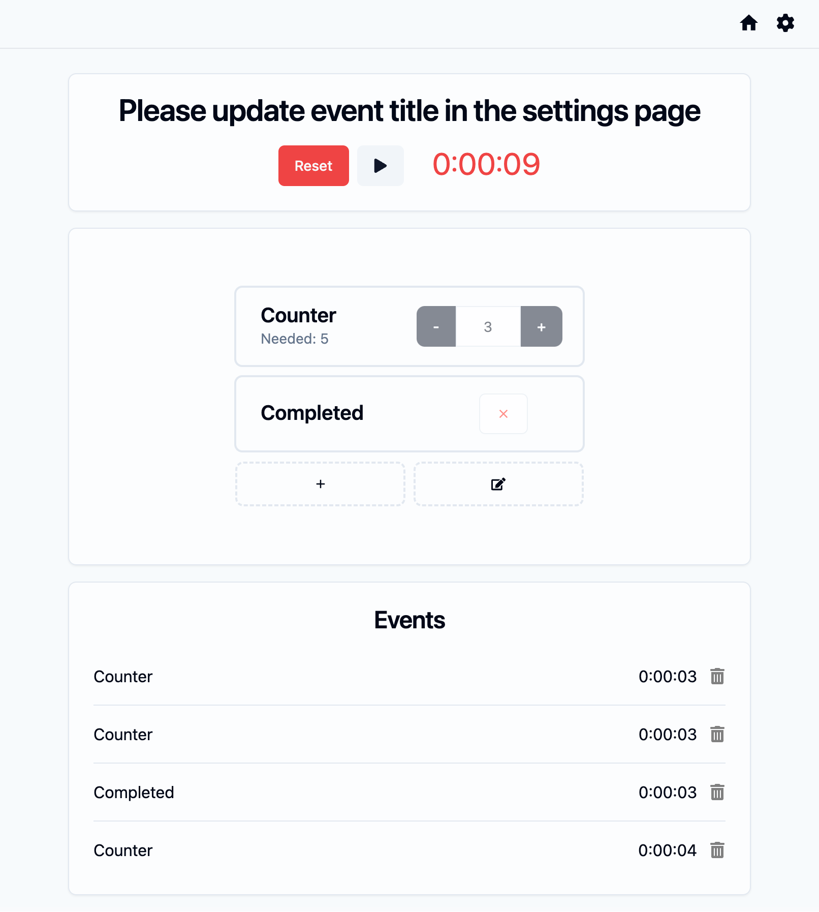
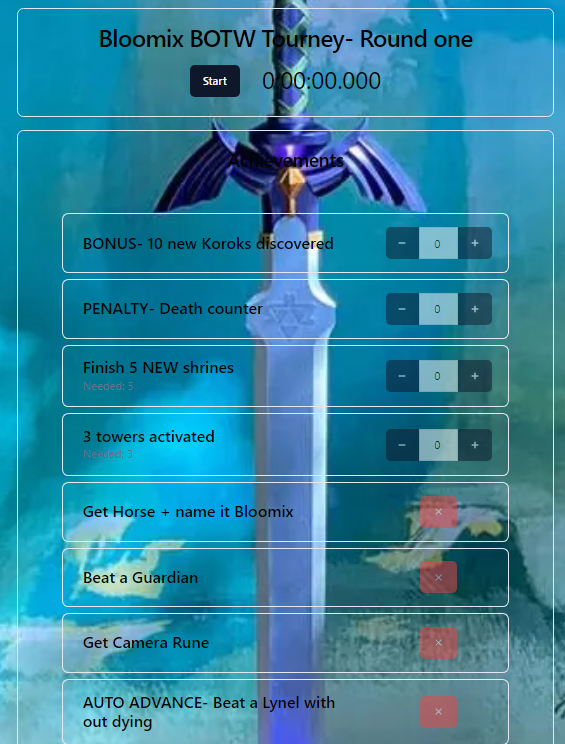
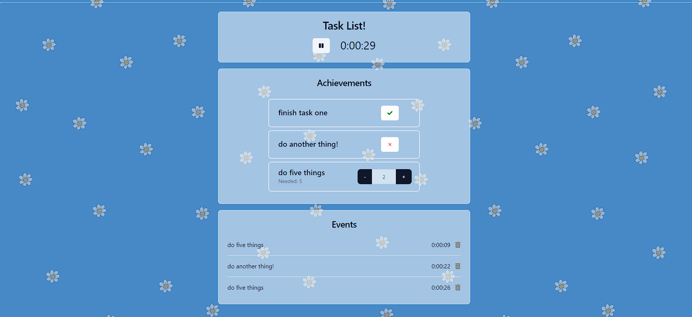
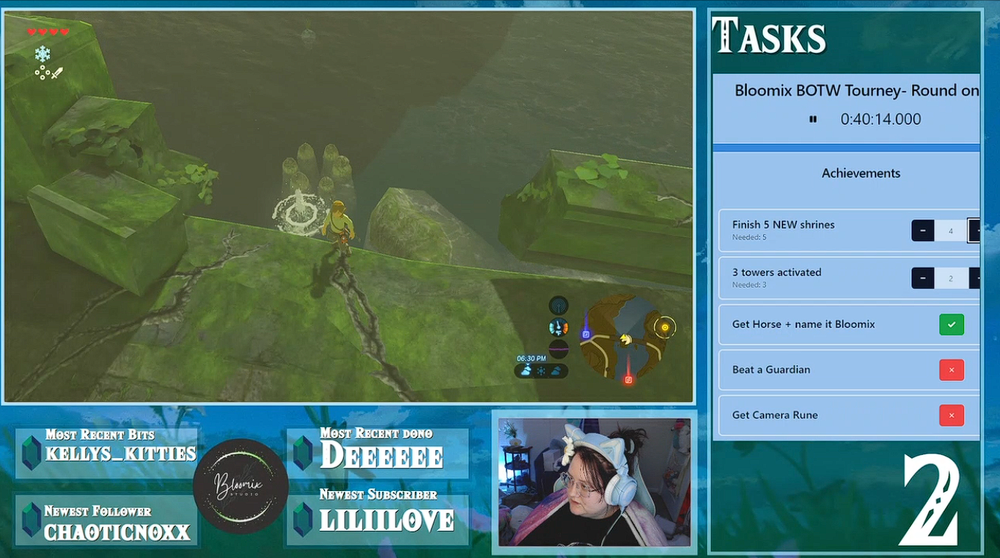

# Stream Gaming Checklist Timer <!-- omit from toc -->

A highly customizable streamer's tool for keeping track of when objectives are completed.

Table of Contents:

- [Reason](#reason)
- [Customization](#customization)
- [Sharing and Templates](#sharing-and-templates)
- [Examples](#examples)
- [Upcoming additions](#upcoming-additions)

## Reason

I came up with this idea when my wife was in a Animal Crossing tournament on [Twitch](https://twitch.tv). She needed to accomplish a set of tasks, such as finding Leo villagers or finding specific villagers, and results would be decided on when certain objectives were completed. When I saw the requirements, it reminded me of watching speed-runners trying to complete certain objectives by a certain time.

## Customization

The default options for this app are extremely bland and I know how much time streamers put into getting the aesthetic of their layout perfect for their stream. If you click on the Gear (⚙) icon in the upper right hand corner, you will find ways to customize the following:

- Event Title
- Timer Interval (display updates every second, 10 milliseconds, or 100 milliseconds)
- Full page background color/photo
- Card colors (each section)
- Text color
- Timer pause color (red by default)

You will also see an option for uploading a settings file (see [Sharing and Templates](#sharing-and-templates))

## Sharing and Templates

Sharing is caring! And convenient when you want to share your event checklist with friends. If you click on the Gear (⚙) icon in the upper right hand corner, you can download everything about your checklist! This includes

- Event Trackers
- Events
- Timer value
- Everything in [Customization](#customization)

Once downloaded, you can send the resulting file with your friends. If they go to the settings page, there is an "Upload Settings File" section where they can upload your file. This can be great for creating templates. If you want to compete with some friends, create the Event Trackers you want everyone to use and share!

## Examples

Default layout:

  

Example by [@Renspeon](https://www.twitch.tv/renspeon)

  

Examples by [@JennyKikiLv24](https://www.twitch.tv/jennykikilv24)

  
  

## Upcoming additions

I'd like to continue working on this. I will eventually upload some examples to this file, but I'm not great with color matching. If you have an example you're proud of though, I'd be happy to take a look at it! For now, create an "Issue" and share your images. I'm not especially picky about the issue format/template.

Other items in my To Do list:

- Tests! Lots and lots of Tests!
- Customizable fonts.
- Possibly encrypting the shared files?

If you'd like to see some items added to this project, you can let me know by creating an issue! Please remember I am a sole individual working on this project and it might take me a while to complete. If you'd like a new feature expedited, please leave a tip with a link to the issue or issue number in the message and I will get it added as quickly as I can. I am also open to collaboration, so if you'd prefer to implement it yourself, feel free to leave a pull request and I'll review it.
